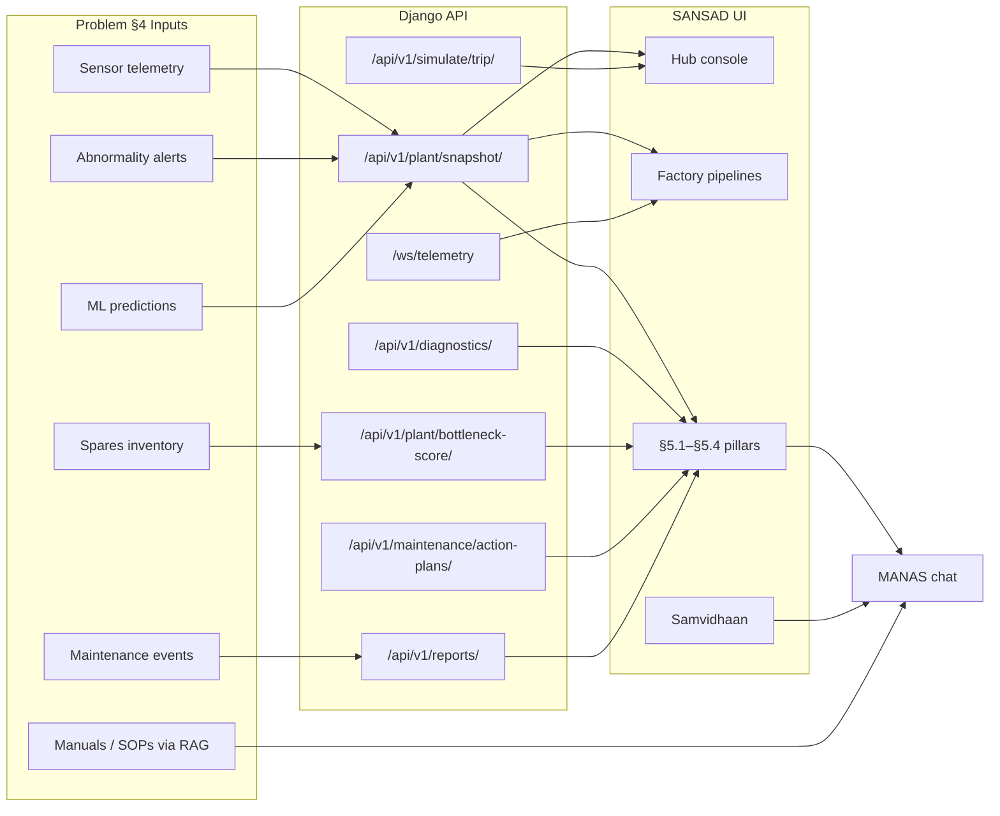

# SANSAD — Summary & Problem-Statement Mapping

**Project ATAL** · Tata Steel AI Hackathon Round 2  
**SANSAD** = industrial telemetry & maintenance decision-support console (frontend: `/sansad`)  
**Companion:** [MANAS](/manas/chat) — conversational Maintenance Wizard (LLM + RAG)

This document lists every SANSAD page, the backend APIs each page uses, what the page is for, and how it satisfies the [hackathon problem statement](Planning/MDs/tata_steel_ai_hackathon_problem_statement.md).

---

## 1. What we built (your “want”)

From the problem statement **§2 Objective**, the Maintenance Wizard must help engineers:

| Goal | Where in SANSAD |
|------|-----------------|
| Faster, accurate diagnosis | Diagnostics pillar, factory pipeline nodes, plant snapshot |
| Probable root causes | Diagnostics → RCA panel + MANAS RCA insight |
| RUL / degradation prediction | Unified RUL calculator (≤300 h sim cap), all hub pages |
| Abnormality & catastrophic early warning | Header **Abnormality** control, alerts, diagnostics early-warning copy |
| Prioritized maintenance under constraints | Risk pillar (criticality, spares, lead time, bottleneck rank) |
| Structured insights & reports | Intelligence Reports + Samvidhaan historical dossiers |
| Reactive + proactive planning | Actions pillar (immediate steps + long-term monitoring) |
| Natural language follow-up | MANAS chat linked from every hub screen |

**Factories modelled**

| Code | Name | Pipeline route |
|------|------|----------------|
| F1 | Horizon (hot rolling) | `/sansad/hub/horizon-foundry` |
| F2 | Zephyr (cold mill / galvanizing) | `/sansad/hub/zephyr-sinter` |

Each factory has four assets on the production line (SRF, HHPD, FS, HAGCC for F1; APT, TCMS, CGP, HPAK for F2).

---

## 2. Architecture (data flow)



---

## 3. Page catalogue

### 3.1 Entry & marketing

| Route | Page | Purpose | APIs / data | Problem statement |
|-------|------|---------|-------------|-------------------|
| `/sansad` | SANSAD landing | Scroll-grid marketing entry to the industrial dashboard; animated telemetry teaser | Mock telemetry cells (no live API) | **§7** Visualization dashboard; simulated IoT |
| `/sansad/hub` | **SANSAD Hub** (main console) | Single-pane operations view: both factories, live tickers, system log stream, links to all §5 pillars | See [§4 Hub console APIs](#4-hub-console-shared-apis) | **§2** decision-support hub; **§7** real-time dashboard |

---

### 3.2 Factory pipeline viewers

| Route | Page | Purpose | APIs / data | Problem statement |
|-------|------|---------|-------------|-------------------|
| `/sansad/hub/horizon-foundry` | Horizon pipeline | **View** (not edit) F1 asset chain: health, RUL (hours), sensors, floating alerts | `GET /api/v1/factories/`, `GET /api/v1/assets/?factory_id=`, `GET /api/v1/plant/snapshot/?factory_id=`, `GET /api/v1/telemetry/snapshot/?factory=`, `GET /api/v1/alerts/`, `GET /api/v1/reports/`, `GET /api/v1/simulate/plant/`, `WS /ws/telemetry`, `POST /api/v1/simulate/{asset_id}/` (reset only) | **§4.2** condition monitoring; **§5.1** RUL; **§6.5** abnormality; **§7** equipment health visualization |
| `/sansad/hub/zephyr-sinter` | Zephyr pipeline | Same as Horizon for F2 | Same endpoints | Same |

**Note:** Abnormality injection is **global** via header `AnomalyTripControl` — not per-node. Nodes show fault state when backend reports `fault_injected`.

---

### 3.3 Samvidhaan command center

| Route | Page | Purpose | APIs / data | Problem statement |
|-------|------|---------|-------------|-------------------|
| `/sansad/hub/samvidhaan` | Samvidhaan CC | Agent orchestration map: F1/F2 nodes, links to MANAS, graphs, reports, legend | `GET /api/v1/plant/kpis/`, `usePlantSnapshot` → `GET /api/v1/plant/snapshot/`, notification feed | **§2** consolidate diagnostics for supervisors; routes to MANAS (**§6.3**) |
| `/sansad/hub/samvidhaan/graphs` | Maintenance snapshots | Plain-language **per-factory** boards: health bar, life-left (hours), risk, action label | `GET /api/v1/samvidhaan/graphs/` → maintenance snapshot per F1/F2 | **§5.1** RUL; **§5.2** risk; **§5.3** when to act; **§6.4** explainable |
| `/sansad/hub/samvidhaan/reports` | Historical dossiers | Factory-level markdown plant history (90-day events, alarms, asset table) | `GET /api/v1/samvidhaan/historical-reports/` | **§4.3** historical records; **§5.4** structured reports; **§7** digital logbook |
| `/sansad/hub/samvidhaan/legend` | Site glossary | ISO terms, asset abbreviations, role meanings | `GET /api/v1/glossary/?category=&q=` | **§6.2** knowledge integration; **§7** dynamic knowledge base |

**Redirects (legacy URLs)**

| Old route | Redirects to |
|-----------|----------------|
| `/sansad/hub/samvidhaan/maintenance` | `/sansad/hub/samvidhaan/legend` |
| `/sansad/hub/monitor` | `/sansad/hub/diagnostics` |
| `/sansad/hub/abpred` | `/sansad/hub/risk` |
| `/sansad/hub/historical-logs` | `/sansad/hub/reports` |

---

### 3.4 Four output pillars (problem §5)

Aligned with `SANSAD_OUTPUT_PILLARS` in `frontend/src/services/sansadOutputs.ts`.

#### §5.1 Diagnostics & Prediction — `/sansad/hub/diagnostics`

| What it shows | Deliverable |
|---------------|-------------|
| Per-asset fault class, confidence, RUL (**hours**), sensor envelope status | Probable fault diagnosis |
| Ranked root causes with evidence weights | Root cause analysis |
| Early warning text for critical assets | Catastrophic failure early warning |
| Cross-stage process defect links | Process-related defect detection |
| **Ask MANAS** buttons → RCA overview & defect-correlation insights | **§6.3** NL interaction |

| Method | Endpoint | Role |
|--------|----------|------|
| GET | `/api/v1/plant/snapshot/` | Asset list + diagnostics bundle |
| GET | `/api/v1/diagnostics/{asset_id}/` | Full diagnostic detail refresh |
| POST | `/api/v1/diagnostics/{asset_id}/refresh/` | Re-run ML + consolidation |
| POST | `/api/v1/diagnostics/{asset_id}/rca-insight/` | LLM RCA snippet (MANAS router) |
| POST | `/api/v1/diagnostics/{asset_id}/defect-insight/` | LLM cross-stage defect snippet |

---

#### §5.2 Risk & Priority — `/sansad/hub/risk`

| What it shows | Deliverable |
|---------------|-------------|
| Risk level (low → critical) | Risk classification |
| Urgency score 0–100 | Urgency assessment |
| Bottleneck rank across plant | Bottleneck prioritization |
| Process criticality, delay severity, spares, lead time | **§5.2** prioritization factors |
| **Ask MANAS** → bottleneck insight | Explainable priority narrative |

| Method | Endpoint | Role |
|--------|----------|------|
| POST | `/api/v1/plant/bottleneck-score/` | Ranked assets + scores |
| POST | `/api/v1/plant/bottleneck-score/{asset_id}/insight/` | LLM bottleneck explanation |

---

#### §5.3 Maintenance Actions — `/sansad/hub/actions`

| What it shows | Deliverable |
|---------------|-------------|
| Immediate action bullets | Immediate action points |
| Ordered repair steps (safety, duration) | Step-by-step recommendations |
| Long-term monitoring list | Long-term monitoring |
| Spares table (stock, lead days) | Spare procurement strategy |
| Optimized plan summary (markdown) | Optimized maintenance plan |
| Regenerate plan (per asset / factory scope) | Proactive replanning on abnormality |

| Method | Endpoint | Role |
|--------|----------|------|
| GET | `/api/v1/maintenance/action-plans/` | All plans + regen status |
| GET | `/api/v1/maintenance/action-plans/{asset_id}/` | Single plan |
| POST | `/api/v1/maintenance/action-plans/{asset_id}/regenerate/` | Celery regen task |
| GET | `/api/v1/maintenance/action-plans/regeneration-status/` | Factory-wide regen progress |
| GET | `/api/v1/maintenance/action-plans/task-status/{task_id}/` | Poll Celery completion |

---

#### §5.4 Intelligence Reports — `/sansad/hub/reports`

| What it shows | Deliverable |
|---------------|-------------|
| Filterable report list (maintenance, abnormal alert, decision summary, digital log) | **§5.4** report types |
| Markdown preview with GFM tables | Structured maintenance reports |
| Live asset sensor pills + health/RUL summary | Traceability to live state |

| Method | Endpoint | Role |
|--------|----------|------|
| GET | `/api/v1/reports/` | List reports |
| GET | `/api/v1/reports/{id}/` | Report body |
| GET | `/api/v1/plant/snapshot/` | Live context sidebar |

---

### 3.5 Operations log console — `/sansad/hub/logs`

| Purpose | APIs | Problem statement |
|---------|------|-------------------|
| Searchable, filterable stream of alerts, maintenance events, and report-derived log lines | `GET /api/v1/assets/` (module filters), `buildSystemLogFeed` via `GET /api/v1/alerts/`, `GET /api/v1/maintenance/events/`, `GET /api/v1/reports/` | **§4.1** incident records; **§6.7** real-time alerting; **§7** digital logbook |

---

## 4. Hub console shared APIs

Used across `/sansad/hub` and child pages.

| API | Used for |
|-----|----------|
| `GET /api/v1/plant/snapshot/` | Unified health, RUL, sensors, anomaly flags — **primary SANSAD data contract** |
| `GET /api/v1/plant/kpis/` | Plant health %, avg RUL hours, proactive maintenance KPIs |
| `GET /api/v1/notifications/feed/` | Hub & pillar ticker marquees |
| `GET /api/v1/alerts/?acknowledged=false` | Factory card tickers, log stream |
| `GET /api/v1/ml/predictions/` | RUL / health ticker lines |
| `POST /api/v1/simulate/trip/` | Inject abnormality (header control) |
| `POST /api/v1/simulate/trip/clear/` | Clear abnormality |
| `WS /ws/telemetry` | Live sensor cell updates on pipeline canvas |

**Auth:** All REST calls use JWT from `/api/v1/auth/token/` (login at `/login`).

---

## 5. RUL & abnormality rules (simulation)

Implemented in `backend/apps/assets/rul_calculator.py`:

- **Hard cap:** 300 hours max RUL (demo scale).
- **Health-led:** low health → low RUL (critical + 0% health → ~0 h).
- **Criticality-led:** critical-path assets have lower RUL ceilings than low-criticality assets.
- **Inputs blended:** campaign hours, ML `rul_predictor` (capped), anomaly score, sensor stress, active alerts, fault injection.

Displayed in **hours** everywhere in SANSAD UI (nodes, diagnostics, snapshots, tickers).

---

## 6. MANAS integration (problem §6)

SANSAD is the **structured output layer**; MANAS is the **conversational layer**.

| Touchpoint | Behavior |
|------------|----------|
| Hub header | Link to `/manas/chat` |
| `HubManasNotify` (hub layout) | Toast on MANAS API success/failure from Diagnostics, Risk, Actions |
| Diagnostics | POST RCA + defect insights → short LLM narratives |
| Risk | POST bottleneck insight |
| Actions | Regenerate plan triggers backend Celery + MANAS polish |
| Samvidhaan | Positions MANAS as reasoning brain in factory graph |

MANAS endpoints (not SANSAD pages): `/api/v1/chat/sessions/`, `/api/v1/rag/query/`, WebSocket chat stream.

---

## 7. Deliverables checklist (problem §9 + §8)

| Deliverable | SANSAD evidence |
|-------------|-----------------|
| Working prototype | All routes above on `ui-console` (:3000) behind nginx (:80) |
| Explainable outputs | Snapshot components, maintenance snapshot plain-English, markdown reports |
| Diagnostic + predictive | Diagnostics pillar + RUL on every asset |
| Risk + priority | Risk pillar + bottleneck API |
| Maintenance recommendations | Actions pillar + work orders path |
| Reporting | Intelligence Reports + Samvidhaan historical dossiers |
| Abnormality detection | `simulate/trip`, alerts, anomaly scores in ML pipeline |
| Real-time alerting | WebSocket telemetry, notification feed, log stream |
| Visualization dashboard | Hub + factory pipelines + maintenance snapshots |
| Feedback loop | Report feedback API `/api/v1/reports/{id}/feedback/`, chat message feedback |
| Demo narrative | Hub → inject abnormality → Diagnostics → Risk → Actions → Reports → MANAS |

---

## 8. Quick route index

```
/sansad                          Landing
/sansad/hub                      Main console
/sansad/hub/horizon-foundry      Factory 1 pipeline viewer
/sansad/hub/zephyr-sinter        Factory 2 pipeline viewer
/sansad/hub/samvidhaan           Command center
/sansad/hub/samvidhaan/graphs    Maintenance snapshots (F1 + F2)
/sansad/hub/samvidhaan/reports   Historical plant dossiers
/sansad/hub/samvidhaan/legend    Glossary
/sansad/hub/diagnostics          §5.1 Diagnostics & Prediction
/sansad/hub/risk                 §5.2 Risk & Priority
/sansad/hub/actions              §5.3 Maintenance Actions
/sansad/hub/reports              §5.4 Intelligence Reports
/sansad/hub/logs                 System log console
/manas/chat                      Maintenance Wizard (NL)
```

---

## 9. Key backend modules (for reviewers)

| Module | Responsibility |
|--------|----------------|
| `apps/assets/rul_calculator.py` | Unified RUL (300 h cap, criticality correlation) |
| `apps/assets/diagnostics_service.py` | §5.1 aggregator |
| `apps/maintenance/threshold_scorer.py` | Risk / urgency features |
| `apps/consolidation/scoring.py` | Bottleneck + plant priority |
| `apps/maintenance/intelligence_report.py` | Markdown report generation |
| `apps/assets/maintenance_snapshot.py` | Samvidhaan graphs payload |
| `apps/assets/anomaly_trip.py` | Abnormality inject + report regen trigger |
| `apps/agents/` | MANAS chat, LangGraph, RAG |

---

*Generated for Project ATAL — Tata Steel AI Hackathon Round 2. Update this file when routes or API contracts change.*
